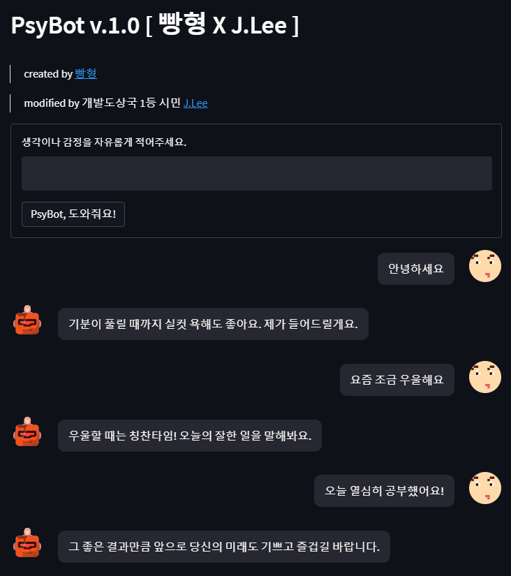

# 심리상담 챗봇

심리상담 정신건강 상담 챗봇. AI chatbot for psychology consultation.

## Pretrained Model

SentenceBERT [jhgan/ko-sroberta-multitask](https://huggingface.co/jhgan/ko-sroberta-multitask)

## Dataset

[웰니스 대화 스크립트 데이터셋](https://aihub.or.kr/opendata/keti-data/recognition-laguage/KETI-02-006)

## Dependency

- streamlit
- streamlit-chat
- pandas
- sentence-transformers
- scikit-learn

## Comments

This project was initially created by [Brad](https://github.com/kairess) for his YouTube channel, but [J.Lee](https://github.com/ee-juni) took an interest in it and cloned the repository.
J.Lee added additional comments to the code whilst watching [Brad's video](https://www.youtube.com/watch?v=VVArHrsxrYU), and made some modifications to overcome minor errors.
J.Lee plans to find ways to either improve the model or the UI, or even use this project to practice deploying web apps.